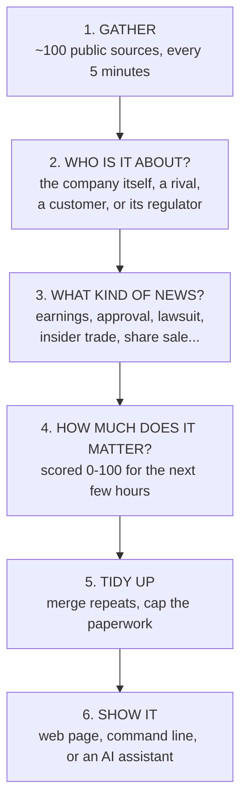

# How it works

A plain-language walk through the system: where the information comes from, what
happens to it, and how it reaches your screen. No code, no jargon.

For the engineering view, see [`ARCHITECTURE.md`](ARCHITECTURE.md).

---

## The one-line version

Every five minutes the system re-reads its sources — around a hundred news
searches, plus every company's official filings and its industry's regulators —
works out which of your 22 companies each story actually concerns, decides how
much it could move the price today, throws away the routine paperwork, and puts
what is left on one page.

---

## The flow

---

## 1. Where the information comes from

Five different kinds of source, deliberately. Each covers a blind spot in the
others.

| | What it is | Why it matters |
|---|---|---|
| **The companies themselves** | Official filings to the US regulator, company press releases, and Israeli disclosures to the Tel Aviv exchange | The most trustworthy source there is. A company is legally obliged to be accurate here |
| **Regulators** | Drug approvals, medical-device clearances, export-control rules, aviation safety directives, energy filings, clinical-trial registrations | Often the *first* public sign that something has changed |
| **The press** | Google News in English and Hebrew, Globes | Broad safety net. Fast, but rewritten and less reliable, so it counts for less |
| **Competitors** | The same news channels, but searched for rivals' product names | See below — this is the unusual part |
| **The market itself** | Prices, trading volume, and sector indexes | Tells you whether anyone is actually acting on the news |

### The unusual part: news about other companies

Most news tools tell you what was written about *your* stock. A lot of what
moves a stock is written about somebody else.

If a competitor's drug fails its trial, that is information about your company.
If a rival launches a product into your market, that is information. If a
regulator acts against your industry, that is information — and none of it
mentions your company at all.

So the system deliberately goes looking for competitors' news, and every story
is labelled with *how* it relates to you:

- **Direct** — the company itself. Treat as fact about it.
- **Rival product** — a competitor's product, trial or launch.
- **Peer** — a competitor's own news. Tells you about the mood in the sector, not about your company.
- **Customer** — someone whose spending is your revenue.
- **Sector regulator** — a regulator acting on your industry.

That label always travels with the story, so a competitor's bad news is never
presented as yours.

---

## 2–4. What happens to every story

Each item is put through the same four questions.

**Who is this about?** The system looks for company names, nicknames, Hebrew
names, ticker symbols, product names and rivals' product names. One story can
touch several of your companies, in different ways.

**What kind of news is it?** Earnings, guidance change, drug approval, clinical
result, takeover, share issue, insider trade, lawsuit, export restriction, and so
on. The kind matters more than the wording: a takeover is always big, a
conference invitation never is.

**How much can it move the price in the next few hours?** This is a score out of
100, and it is deliberately *not* a measure of general importance. A long-term
strategy story scores low. A surprise share issue in a small company scores high.
The score is built from:

- what kind of news it is
- how reliable the source is (an official filing counts far more than a blog)
- how it relates to the company (direct news counts more than a rival's)
- how big the company is (the same news moves a small company more)
- **how old it is** — this matters a lot; news decays fast
- whether the share price and trading volume are actually reacting

**Have we seen it already?** The same story usually arrives from several places.
Repeats are merged into one line, and the system notes how many *independent*
sources carried it — which is a useful confidence signal on its own.

### What gets thrown away

Roughly half the value is in what you never see. Routine paperwork is
deliberately pushed down: annual meeting notices, "our CEO will speak at a
conference", sustainability reports, index-fund holding changes, and automated
"Fund X bought 44,869 shares" articles generated from filings up to 45 days old.

The same applies to insider trades. An executive being *granted* shares as part
of their pay is routine and is pushed down; an executive *buying or selling on
the open market* is a real signal and is kept.

---

## 5. Three ideas that make the output different

**A move only means something next to its sector.** A stock up 12% on a day its
industry index rose 8% has really only moved 4% on its own. The system shows both
numbers, so "the whole sector went up" is never mistaken for "something happened
at this company".

**News published after the market closes cannot explain today's move.** A filing
that arrives at 16:13, thirteen minutes after the bell, is shown as tomorrow's
setup — never as the cause of today's price change.

**Silence is reported honestly.** A quiet screen can mean "nothing happened" or
"the system is broken and you cannot see anything". Those look identical and are
completely different, so anything not working is listed at the top of the page in
plain words — which source, and why.

---

## 6. What you actually see

The web page has four parts, top to bottom:

1. **Coverage warnings** — anything switched off or not working, and why. Read
   this first. If it is empty, silence elsewhere really does mean quiet.
2. **Alerts** — anything urgent in the last 24 hours.
3. **Movers** — every share that moved, with how unusual the trading volume was,
   how much of the move was just its sector, and the best available explanation.
   If there is no explanation, it says so rather than inventing one.
4. **Feed** — the ranked news, most likely to matter first, each line saying
   which company it concerns and how.

Then a calendar of known dates coming up.

The same information is available three other ways: on the command line
(`harel morning`, `harel feed`, `harel brief TEVA`), as a web interface other
programs can read, and as a set of tools an AI assistant can query directly — so
you can ask it questions in plain language instead of reading the page yourself.

---

## The honest limits

- It cannot tell you what analysts are about to do. Ratings changes are one of
  the biggest intraday movers and there is no free, reliable source for them.
- Prices are delayed, not live.
- If a company's news is only ever published somewhere we do not read, we will
  miss it. That is why the coverage warnings exist.

[`LIMITATIONS.md`](LIMITATIONS.md) is the full, blunt version of this list.
